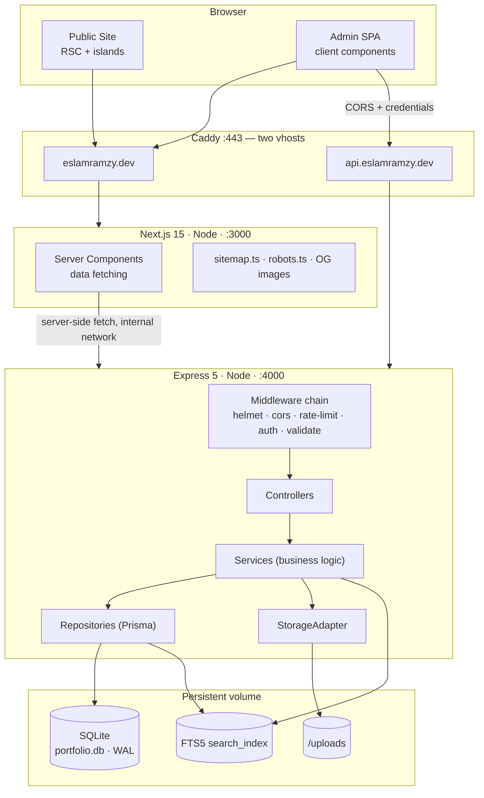
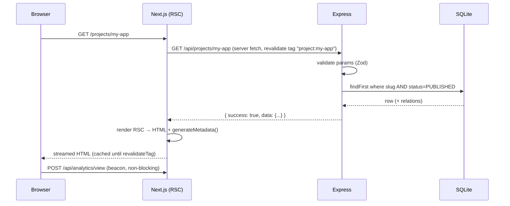
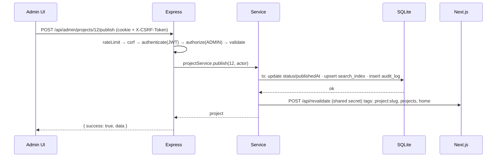
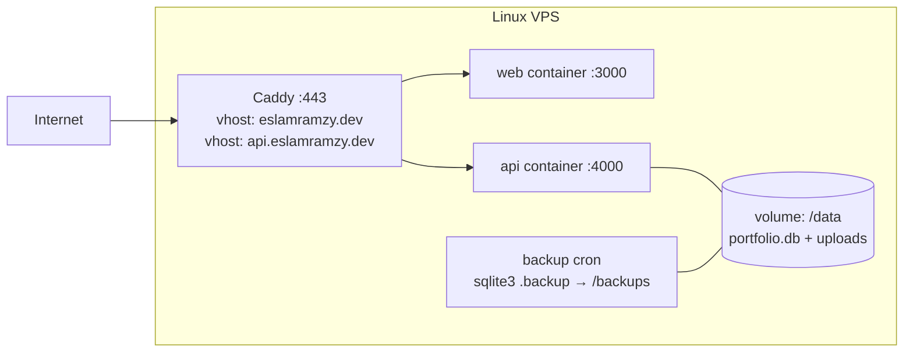

# 01 — System Architecture

## 1. Design principles

1. **Content is data, never code.** No content-shaped value is hardcoded in a component.
2. **The server is the authority.** Draft filtering, authorization and validation are enforced in
   the backend. The UI hiding something is a convenience, never a control.
3. **One direction of dependency.** `routes → controllers → services → repositories → db`.
   A layer never reaches back up. Repositories never import services.
4. **One source of truth for shapes.** Zod schemas in `packages/shared` generate the types used by
   both sides.
5. **Simple beats clever.** (§50)

---

## 2. Component diagram



**Why two processes and not Next.js API routes?**
The brief requires it, and it earns its keep here: §45 demands the API be independently
security-tested (Burp, ZAP, `supertest`). A standalone Express surface with its own middleware chain
is far easier to point a scanner at, and keeps auth/authorization logic in one auditable place
rather than spread across route handlers. The cost is one extra process and the cookie topology
handled below.

---

## 3. Runtime topology — two origins (decision D1)

The two processes are served as **two separate origins from the same registrable domain**:

```
https://eslamramzy.dev            → Next.js   (public site + /admin)
https://api.eslamramzy.dev        → Express   (REST API)
https://api.eslamramzy.dev/uploads/*  → uploaded media, long-lived cache headers
```

### The same-site / cross-origin distinction — this is the load-bearing detail

`eslamramzy.dev` and `api.eslamramzy.dev` are **cross-origin** (scheme+host+port differ, so CORS
applies) but **same-site** (both share the registrable domain `eslamramzy.dev`, and `SameSite` is
evaluated per *site*, not per origin).

Consequences:

| | Effect |
|---|---|
| ✅ `SameSite=Strict` still works | Auth cookies **are** sent on requests from the site's own pages to `api.eslamramzy.dev`. `SameSite=None` is **not** needed and is not used. |
| ✅ CSRF posture stays strong | `SameSite` still blocks genuinely cross-site submissions |
| ⚠️ CORS becomes load-bearing | Every mutating request is preflighted; the allow-list is now a real security control, not defence in depth |
| ⚠️ `Domain=.eslamramzy.dev` is required | Cookies must be shared across the two subdomains |
| ⚠️ **`__Host-` cookie prefix is lost** | `__Host-` forbids a `Domain` attribute. Cookies use the `__Secure-` prefix instead — see the mitigation below |

> **This design requires the API to be a subdomain of the site's own apex domain.** If the API were
> ever moved to a *different* registrable domain, the browser would treat it as cross-site,
> forcing `SameSite=None` and materially weakening the CSRF posture. That constraint is recorded
> here so it is not violated later by accident.

### The cost of losing `__Host-`, and the mitigation

`__Host-` guarantees a cookie was set by the exact origin reading it. Using `Domain=.eslamramzy.dev`
means **any** subdomain can set cookies on the parent domain — a "cookie tossing" / session-fixation
vector if a subdomain is ever compromised or dangles (a stale DNS record pointing at a
deprovisioned third-party service is the classic route in). Mitigations, all adopted:

1. **No wildcard DNS.** Only `eslamramzy.dev`, `www` and `api` records exist. Any future subdomain
   is an explicit, reviewed decision.
2. **Signed CSRF tokens.** The double-submit token is HMAC-bound to the session rather than a plain
   value comparison, so a subdomain that can *set* a cookie still cannot forge a valid pair
   (doc 04 §5).
3. **Server-side session binding.** Refresh tokens are opaque rows in the database; a tossed cookie
   value that does not match a stored hash is rejected outright.
4. **`Origin` header check** on every state-changing request, in addition to CORS.

### Local development mirrors production exactly

`127.0.0.1 local.eslamramzy.dev api.local.eslamramzy.dev` in `/etc/hosts`, with Caddy terminating
local TLS. Developing against `localhost:3000` + `localhost:4000` would be a *different* cookie
topology (no `Domain` attribute, different secure-context rules) and would hide exactly the class of
bug this decision introduces. The dev setup is documented in the README as a required step.

### Server-side fetching

Next.js Server Components call the API over the **internal** container network
(`http://api:4000`), not through the public origin — no TLS handshake, no CORS, no round trip
through Caddy. Cookies are forwarded explicitly on authenticated server-side calls (doc 04 §7).

## 4. Request flows

### 4.1 Public page — `/projects/[slug]`



Draft filtering happens in the **repository**, not the page. A draft project returns `404` from the
API, so there is no code path where an unpublished item can leak.

### 4.2 Admin mutation — publish a project



The transaction boundary is the **service**, and it always covers: the write, the search-index
update, and the audit log. If any of the three fails, none is committed.

---

## 5. Layer contract

| Layer | May do | May **not** do |
|---|---|---|
| Route | Bind path + method to middleware and one controller method | Contain logic, touch Prisma |
| Middleware | Cross-cutting: authn, authz, validation, rate limit, CSRF, logging | Know about entities |
| Controller | Map HTTP ↔ domain: read validated input, call one service, shape the response | Business rules, Prisma access |
| Service | Business rules, transactions, authorization decisions, audit, search index, events | Know about `req`/`res`/HTTP status codes |
| Repository | Prisma queries, `status` filtering, selection/pagination | Business rules, throw HTTP errors |
| Prisma client | Single shared instance, WAL pragmas set at startup | — |

Errors travel as typed `AppError` subclasses (`NotFoundError`, `ValidationError`, `ForbiddenError`,
`ConflictError`) thrown from services; one error middleware maps them to status codes and the error
envelope. Services never import `express`.

---

## 6. Cross-cutting concerns

| Concern | Where it lives |
|---|---|
| Validation | `middleware/validate.ts` + shared Zod schemas (body/query/params/files) |
| AuthN | `middleware/authenticate.ts` — verifies access JWT, loads user, attaches `req.user` |
| AuthZ | `middleware/authorize.ts` (coarse: role) + service-level checks (fine) |
| Audit | `services/auditService.ts`, called inside the same transaction as the mutation |
| Rate limit | `middleware/rateLimit.ts` — per-route buckets (doc 09) |
| Errors | `middleware/errorHandler.ts` — last in chain, no stack traces in production |
| Logging | `pino` structured logs with a redaction list (`password`, `token`, `cookie`, `authorization`) |
| Config | `config/env.ts` — Zod-parsed `process.env`, **fails fast at boot** if invalid |
| Search index | `services/searchService.ts`, invoked by content services after commit |
| Cache invalidation | `services/revalidationService.ts` → Next.js on-demand revalidation |

---

## 7. Caching and revalidation

| Content | Strategy |
|---|---|
| Public pages (home, lists, detail) | RSC + `fetch(..., { next: { tags: [...] } })`, revalidated **on demand** at publish |
| `generateStaticParams` | Published slugs at build time; `dynamicParams: true` for anything newer |
| Sitemap / robots | Regenerated on the same revalidation tags |
| Admin | `no-store` everywhere. Never cached, `Cache-Control: no-store, private` |
| Uploads | `Cache-Control: public, max-age=31536000, immutable` (filenames are content-hashed) |
| API responses | No HTTP cache for admin; `s-maxage` only on public GETs |

Time-based revalidation is a fallback (`revalidate: 3600`), not the primary mechanism — the admin
publishing an article should see it live immediately, not in an hour.

---

## 8. Deployment



- `docker-compose.yml` with two services + one named volume. No database container (SQLite is a file).
- Caddy serves **two vhosts** with one certificate each (automatic ACME), and only Caddy is exposed;
  the containers talk over the internal Docker network, which is also how Next.js reaches the API
  server-side without a public round trip.
- Health endpoints: `GET /api/health` (liveness) and `/api/health/ready` (DB reachable + migrations applied).
- Migrations run as a one-shot `prisma migrate deploy` step on container start, before the API listens.
- Zero-downtime is explicitly **not** a goal for a personal portfolio — a 3-second restart is fine.

---

## 9. What is deliberately deferred

| Deferred | Reserved seam |
|---|---|
| PostgreSQL | Prisma provider swap + enum promotion; no raw SQL outside FTS5, which is isolated in `searchRepository.ts` |
| S3/R2 object storage | `StorageAdapter` interface |
| GitHub API integration | `projects.github_url` column + an unimplemented `GithubService` boundary |
| Email delivery | `MailerAdapter` with a `NoopMailer` default |
| Multi-user / EDITOR role | `users.role` column + `authorize()` middleware already role-aware |
| i18n | Not seamed. Retrofitting is expensive — decide now (**D10**) |
