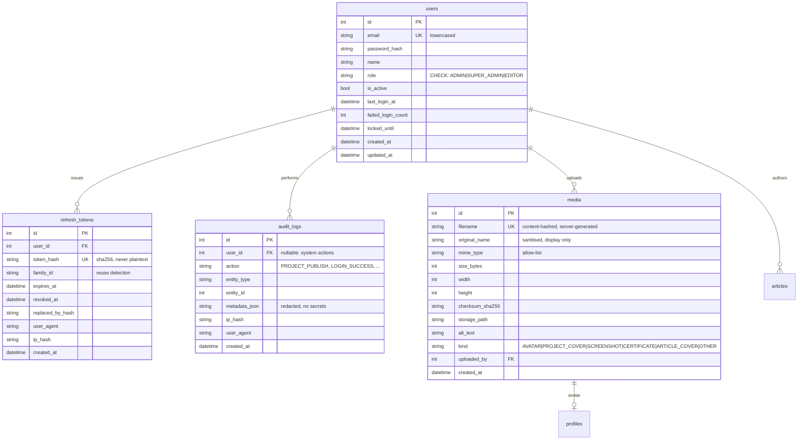
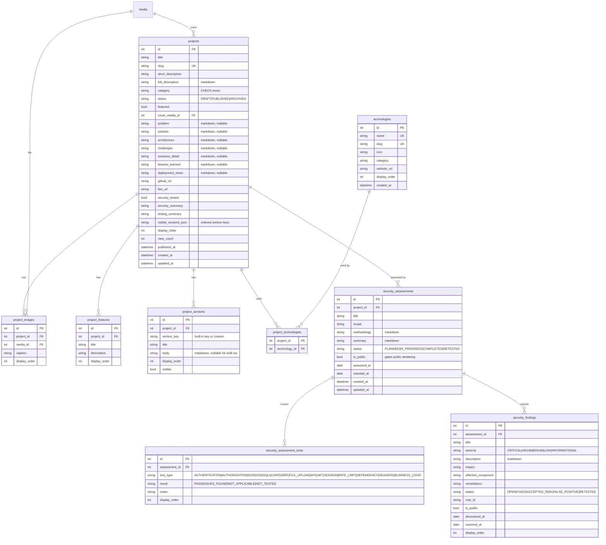
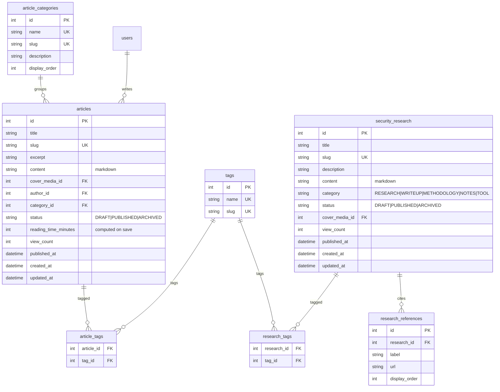
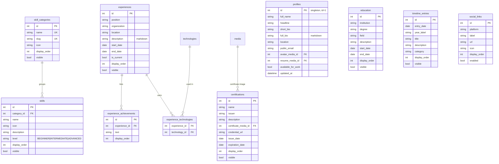
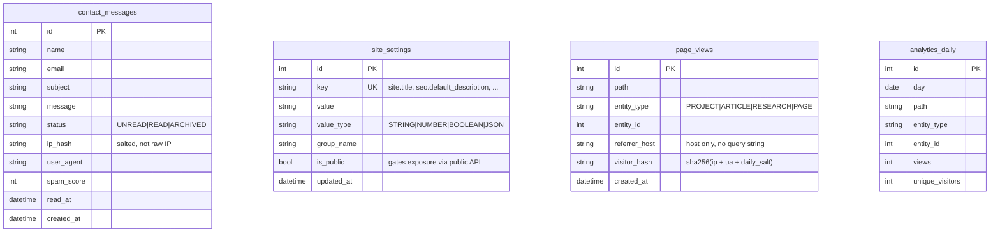

# 02 — Database Architecture

**Engine:** SQLite (WAL) · **ORM:** Prisma · **Migrations:** `prisma migrate` (+ hand-written raw SQL
for `CHECK` constraints and FTS5).

---

## 1. Conventions

| Rule | Decision |
|---|---|
| Primary key | `id INTEGER PRIMARY KEY AUTOINCREMENT` (SQLite rowid — fastest, smallest). Public URLs use `slug`, never `id`, so ids are not enumerable in the public surface. |
| Naming | tables `snake_case` plural; columns `snake_case`; Prisma models `PascalCase` singular via `@@map` |
| Timestamps | `created_at`, `updated_at` on every mutable table (`DATETIME`, UTC, ISO-8601) |
| Soft delete | **Not used.** `status = ARCHIVED` covers the requirement (§52). Deletes are real deletes + an audit log entry. |
| Enums | `TEXT` + SQLite `CHECK` constraint + Zod union + TS union (Prisma/SQLite has no enums) |
| Booleans | `INTEGER` 0/1 (Prisma `Boolean`) |
| Money/decimals | none in this schema |
| Foreign keys | `PRAGMA foreign_keys = ON` set at every connection. Explicit `ON DELETE` on every FK. |
| Slugs | lowercase, `[a-z0-9-]+`, unique per entity, generated server-side, editable, immutable after first publish unless forced (creates a redirect row → future) |
| Ordering | `display_order INTEGER NOT NULL DEFAULT 0`, sorted `ORDER BY display_order ASC, id ASC` |
| Publishing | `status TEXT CHECK (status IN ('DRAFT','PUBLISHED','ARCHIVED'))` + `published_at DATETIME NULL` |

### Startup pragmas (non-negotiable)

```sql
PRAGMA journal_mode = WAL;      -- concurrent readers during a write
PRAGMA foreign_keys = ON;       -- OFF by default in SQLite!
PRAGMA busy_timeout = 5000;     -- wait instead of throwing SQLITE_BUSY
PRAGMA synchronous = NORMAL;    -- safe with WAL, much faster
-- foreign_keys is PER-CONNECTION in SQLite; it is applied in the Prisma client bootstrap.
```

---

## 2. ERD — Identity, Media, Audit



## 3. ERD — Projects & Security Assessments



> **Public-safety rule:** a finding is rendered publicly only when
> `assessment.is_public AND finding.is_public AND project.status = 'PUBLISHED'`.
> Enforced in `securityRepository`, not in the view. Findings with `status='OPEN'` and
> `severity IN ('CRITICAL','HIGH')` are **never** exposed publicly, regardless of flags —
> publishing an unfixed critical vulnerability in your own live project is a real-world risk.

## 4. ERD — Articles & Security Research



## 5. ERD — Profile, CV, Site



## 6. ERD — Operations



`search_index` is an **FTS5 virtual table**, created by raw SQL migration (Prisma cannot model it):

```sql
CREATE VIRTUAL TABLE search_index USING fts5(
  entity_type UNINDEXED,   -- PROJECT | ARTICLE | RESEARCH | TECHNOLOGY
  entity_id   UNINDEXED,
  slug        UNINDEXED,
  title,
  summary,
  body,
  tokenize = 'porter unicode61'
);
```

Only **published** rows are indexed; unpublishing deletes the row. Search therefore cannot leak
drafts even if the query layer had a bug.

---

## 7. Key relationship decisions

| Relationship | Cardinality | On delete | Why |
|---|---|---|---|
| `projects → project_technologies → technologies` | M:N | `CASCADE` on the join only | Deleting a project never deletes a technology |
| `projects → security_assessments` | 1:N | `CASCADE` | An assessment has no meaning without its project; retests are separate rows |
| `security_assessments → findings` | 1:N | `CASCADE` | — |
| `media → projects.cover_media_id` | 1:N | `SET NULL` | Deleting a file must not delete the project |
| `media` deletion | — | Blocked if referenced | The service checks references first and returns `409 CONFLICT` listing usages |
| `users → articles.author_id` | 1:N | `RESTRICT` | Never orphan authorship silently |
| `users → audit_logs` | 1:N | `SET NULL` | Audit history survives user deletion |
| `articles → tags` | M:N | `CASCADE` on join | Tags are shared with research |
| `profiles` | singleton | — | Enforced with `CHECK (id = 1)` |

---

## 8. Indexes

Every FK gets an index (SQLite does **not** create them automatically). Beyond those:

```sql
CREATE UNIQUE INDEX idx_projects_slug          ON projects(slug);
CREATE        INDEX idx_projects_status_pub    ON projects(status, published_at DESC);
CREATE        INDEX idx_projects_featured      ON projects(featured, display_order) WHERE status='PUBLISHED';
CREATE UNIQUE INDEX idx_articles_slug          ON articles(slug);
CREATE        INDEX idx_articles_status_pub    ON articles(status, published_at DESC);
CREATE        INDEX idx_articles_category      ON articles(category_id, status);
CREATE UNIQUE INDEX idx_research_slug          ON security_research(slug);
CREATE        INDEX idx_research_status_pub    ON security_research(status, published_at DESC);
CREATE UNIQUE INDEX idx_users_email            ON users(email);
CREATE UNIQUE INDEX idx_refresh_token_hash     ON refresh_tokens(token_hash);
CREATE        INDEX idx_refresh_user_active    ON refresh_tokens(user_id, revoked_at);
CREATE        INDEX idx_audit_created          ON audit_logs(created_at DESC);
CREATE        INDEX idx_audit_entity           ON audit_logs(entity_type, entity_id);
CREATE        INDEX idx_messages_status        ON contact_messages(status, created_at DESC);
CREATE        INDEX idx_pageviews_day          ON page_views(created_at);
CREATE        INDEX idx_pageviews_entity       ON page_views(entity_type, entity_id, created_at);
CREATE UNIQUE INDEX idx_analytics_daily_uniq   ON analytics_daily(day, path, entity_type, entity_id);
CREATE UNIQUE INDEX idx_settings_key           ON site_settings(key);
```

Partial indexes (`WHERE status='PUBLISHED'`) are used because ~every public query filters on it and
SQLite supports them well.

---

## 9. Migration policy

- Every schema change is a **committed migration**. No `prisma db push` outside a scratch branch.
- Migration files are **read before commit** — Prisma's SQLite table-rebuild strategy can silently
  drop data on a column rename. Renames get a hand-written `-- CreateTable/INSERT SELECT/DROP` pair.
- `CHECK` constraints, partial indexes, FTS5 tables and triggers live in hand-authored SQL appended
  to the generated migration.
- `prisma migrate deploy` runs on container start, before the API accepts traffic. Never
  `migrate dev` in production.
- Rollback = restore the pre-migration backup. A `sqlite3 .backup` snapshot is taken automatically
  in the deploy script immediately before `migrate deploy`.

## 10. Seeding

| Script | Environment | Contents |
|---|---|---|
| `npm run db:bootstrap` | **all**, idempotent | Admin user (from `ADMIN_EMAIL` / `ADMIN_INITIAL_PASSWORD`, forced change on first login), the 7 skill categories, default `site_settings`, the singleton `profiles` row |
| `npm run db:seed` | dev/test only — refuses to run when `NODE_ENV=production` unless `--force` | Demo projects, articles, research, technologies, timeline. All flagged `is_demo` in the audit log so it is obvious what came from seed |

Per §21/§54: production never contains demo content.

## 11. Backups

`sqlite3 /data/portfolio.db ".backup /backups/portfolio-$(date +%F-%H%M).db"` on a daily cron,
7 daily + 4 weekly retained, plus `/data/uploads` in the same archive. `.backup` is used rather
than `cp` because it is safe against concurrent writers. Restore procedure documented in Phase 15.
