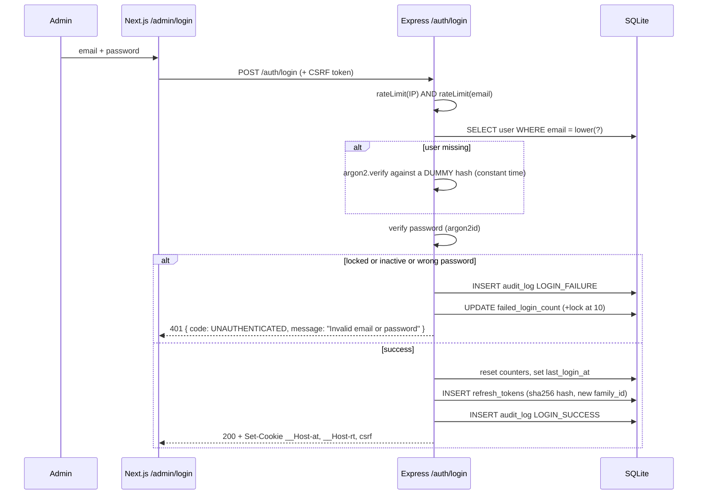
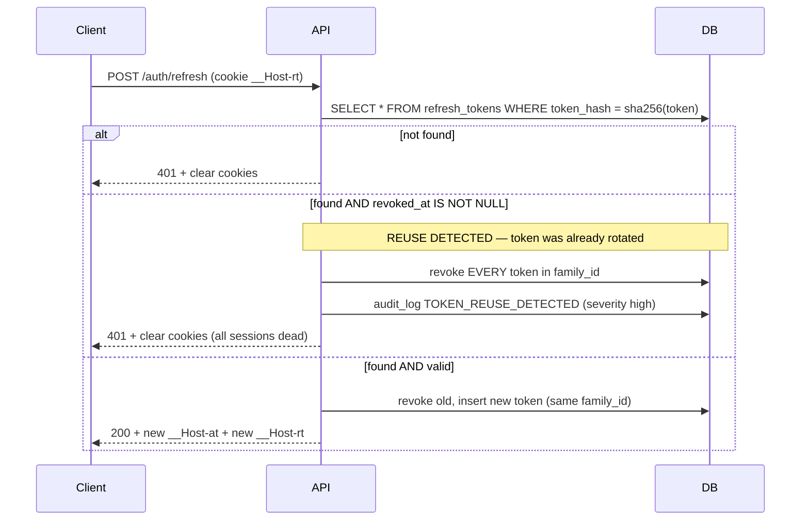

# 04 — Authentication Architecture

Single admin, no public registration (§25). The design still has to be genuinely correct, because
this is the highest-value target on the whole platform and you intend to pentest it (§57).

---

## 1. Token model

| Token | Lifetime | Storage | Contents |
|---|---|---|---|
| **Access token** (JWT, HS256) | **15 minutes** | `__Host-at` cookie: `HttpOnly; Secure; SameSite=Strict; Path=/` | `sub`, `role`, `tokenVersion`, `iat`, `exp`, `iss`, `aud`, `jti` |
| **Refresh token** (opaque, 32 random bytes, base64url) | **7 days**, rotated on each use | `__Host-rt` cookie: `HttpOnly; Secure; SameSite=Strict; Path=/api/v1/auth` | Nothing — it is a random string; state lives in `refresh_tokens` |

**Why the refresh token is opaque, not a JWT:** a JWT refresh token cannot be revoked without a
server-side list anyway, so the JWT adds nothing but a bigger cookie and a second signing key to
leak. An opaque token is a database lookup, which is what revocation and reuse-detection require.

**Why the access token is a cookie, not `Authorization: Bearer`:** because the frontend and API are
same-origin (doc 01 §3), cookies are first-party and `HttpOnly` — which removes the entire class of
"XSS steals the token from `localStorage`". The trade is CSRF exposure, handled in §5 below.
This trade is the right one: XSS token theft is silent and persistent; CSRF is fully mitigable with
a token that JavaScript from another origin cannot read.

`Path=/api/v1/auth` on the refresh cookie means it is not transmitted on ordinary API calls — it is
only exposed on the three endpoints that need it, shrinking its attack surface.

---

## 2. Login flow



Details that matter:

- **Constant-time failure.** When the email does not exist, a dummy Argon2 verification still runs.
  Without it, response timing distinguishes "no such user" from "wrong password" — a user
  enumeration oracle.
- **Identical error message** for unknown email, wrong password, locked account, and inactive
  account. The reason is recorded in the audit log, not in the response.
- **Dual rate limit** (per IP *and* per email) so a distributed attack cannot bypass the IP bucket,
  and a single IP cannot spray many accounts.
- **Lockout:** 10 consecutive failures → `locked_until = now + 15 min`, exponential on repeat.
  Because there is one admin, a lockout is a DoS on yourself — hence the CLI unlock script (**D7**).

---

## 3. Refresh rotation with reuse detection



This is the important property: a stolen refresh token can be used **at most once**, and the moment
the legitimate client uses its copy, the theft is detected and the whole family is killed. Without
rotation + reuse detection, a leaked refresh token is a 7-day silent backdoor.

Tokens are stored as **SHA-256 hashes**. A database read (SQL injection, a leaked backup, a stolen
volume snapshot) yields no usable tokens. SHA-256 is correct here rather than Argon2 because the
token is 256 bits of entropy — it is not brute-forceable, and refresh happens on a hot path.

---

## 4. Password storage

- **Argon2id**, `memoryCost = 19456 KiB (19 MiB)`, `timeCost = 2`, `parallelism = 1` — the OWASP
  Password Storage Cheat Sheet minimum. Tuned upward if the VPS can afford it.
- Rejected: bcrypt (72-byte truncation, weaker against GPU), PBKDF2 (weakest of the three),
  anything with a hand-rolled salt (Argon2 embeds its own).
- Never logged, never returned, never in an audit log, excluded from every Prisma `select`
  via an explicit field list (no `select: *` on `users`).
- Minimum 12 characters, checked against a small list of common passwords. No composition rules
  (they push users toward `Password1!`), no maximum length below 128, no truncation.
- Changing the password bumps `users.token_version`, which invalidates every outstanding access
  token immediately (the JWT carries `tokenVersion` and it is compared on every request).

## 5. CSRF protection

Cookie auth requires it. Two layers:

1. **`SameSite=Strict`** on both auth cookies — blocks essentially all cross-site submissions in
   current browsers. This is the primary control.
2. **Double-submit token** for defence in depth: `GET /auth/csrf` sets a non-`HttpOnly`
   `__Host-csrf` cookie and returns the same value; the admin client echoes it in `X-CSRF-Token`
   on every `POST/PATCH/PUT/DELETE`. The server compares them in constant time.

Both are required because `SameSite` alone fails against a same-site subdomain takeover, and the
double-submit alone fails if an attacker can set cookies. Together they cover each other.

Public `POST /contact` is exempt from CSRF (it is unauthenticated — there is no session to ride) but
carries its own rate limit, honeypot and timing check.

## 6. Session lifecycle in the admin UI

- The access token expires in 15 minutes; the admin client does **not** poll. On any `401` with
  `code: TOKEN_EXPIRED`, a single-flight refresh runs and the original request is retried once.
  Concurrent 401s share one in-flight refresh promise (otherwise five parallel refreshes rotate the
  token five times and four of them look like reuse).
- If refresh fails → clear client state, redirect to `/admin/login?reason=expired`.
- "Log out everywhere" revokes all families.
- Idle timeout is effectively 7 days (refresh lifetime); absolute session cap is 30 days
  (`family` created_at), after which a full re-login is required.

## 7. Server-side auth in Next.js

Server Components rendering `/admin/*` must forward cookies explicitly:

```ts
// apps/web/src/lib/api/serverClient.ts
import { cookies } from 'next/headers';
export async function serverFetch(path: string, init?: RequestInit) {
  const cookieHeader = (await cookies()).toString();
  return fetch(`${process.env.API_INTERNAL_URL}${path}`, {
    ...init,
    headers: { ...init?.headers, cookie: cookieHeader },
    cache: 'no-store',
  });
}
```

`API_INTERNAL_URL` points at the container-internal address (`http://api:4000`), so server-side
traffic never leaves the host. Public data fetching uses a separate cached client with no cookies.

**Middleware is a redirect, not a guard.** `apps/web/middleware.ts` redirects unauthenticated
`/admin/*` requests to the login page based on cookie presence only. It does **not** verify the JWT
and is **not** a security control — every admin API call is independently authenticated by Express
(§26: never rely on hiding the UI).

## 8. Bootstrap and recovery

- The first admin is created by `npm run db:bootstrap` from `ADMIN_EMAIL` + `ADMIN_INITIAL_PASSWORD`
  (env, never committed). The account is flagged `must_change_password`; the admin UI forces a change
  before anything else is reachable.
- Recovery: `npm run admin:reset-password -- --email=...` executed on the server (**D7**). No
  email-based reset flow — a public reset endpoint on a single-admin site is pure attack surface.

## 9. Audit events emitted here

`LOGIN_SUCCESS`, `LOGIN_FAILURE`, `LOGOUT`, `LOGOUT_ALL`, `TOKEN_REFRESHED`,
`TOKEN_REUSE_DETECTED`, `ACCOUNT_LOCKED`, `PASSWORD_CHANGED`.
Each records `user_id` (or the attempted email, hashed), `ip_hash`, `user_agent`, timestamp.
Never the password, never the token.
