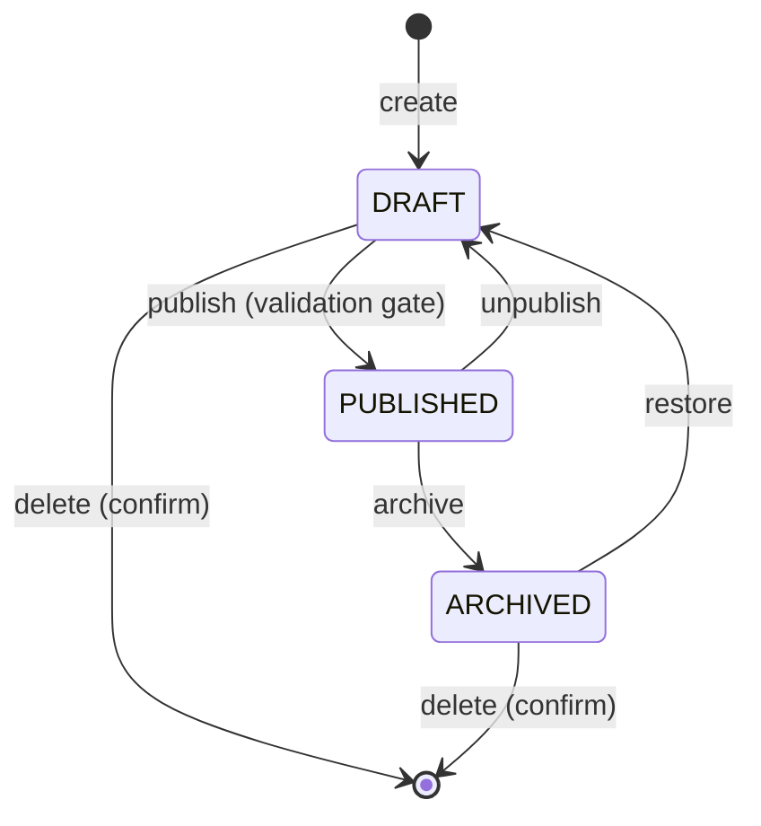

# 07 — Admin Dashboard Architecture

`/admin` — structurally and visually separate from the public site (§20). Its own route group, its
own layout, its own navigation, no shared chrome.

---

## 1. Shell

```
┌──────────────────────────────────────────────────────────┐
│ Topbar: breadcrumb · global ⌘K · theme · user menu       │
├────────────┬─────────────────────────────────────────────┤
│ Sidebar    │                                             │
│ Dashboard  │   <module content>                          │
│ Projects   │                                             │
│ Articles   │                                             │
│ Security…  │                                             │
│ Skills     │                                             │
│ …          │                                             │
│ Audit Logs │                                             │
└────────────┴─────────────────────────────────────────────┘
```

Sidebar order per §51: Dashboard, Projects, Articles, Security Research, Skills, Technologies,
Certifications, Experience, Education, Timeline, Media, Messages, Settings, Audit Logs.
Collapses to an off-canvas drawer below `lg`. The Messages item carries an unread badge.

## 2. The module pattern

Every content module is the same three screens. This is the single most important decision for
delivery speed — 13 modules × a bespoke UI each is where this project would die.

```
/admin/{module}            List: search · status filter · sort · pagination · bulk actions
/admin/{module}/new        Create form
/admin/{module}/[id]       Edit form (+ tabs for complex entities)
```

Shared building blocks in `features/admin/components/`:

| Component | Responsibility |
|---|---|
| `<DataTable>` | Columns, sorting, pagination, empty state, loading skeleton, row actions |
| `<ResourceToolbar>` | Debounced search, status filter, "New" button |
| `<EntityForm>` | `react-hook-form` + `zodResolver` (the shared schema), dirty tracking, unsaved-changes guard, error summary |
| `<StatusBadge>` | Draft / Published / Archived |
| `<PublishControls>` | Publish · Unpublish · Archive · Preview, with state-aware disabling |
| `<ConfirmDialog>` | Required before every destructive action (§22); destructive confirms require typing the entity title |
| `<MediaPicker>` | Modal browser over the media library + inline upload + alt-text prompt |
| `<SortableList>` | Drag-and-drop `display_order`, persisted via `PATCH /reorder` |
| `<MarkdownEditor>` | Split editor/preview, rendered through the same sanitising pipeline as the public site |
| `<TagInput>` | Create-or-select against `/tags` |

A new module is then: a Zod schema (already shared), a column definition, a field definition, and a
route file. Roughly a day each, not a week.

## 3. Modules

| Module | Extra beyond the standard CRUD |
|---|---|
| **Dashboard** | Counter cards (§21), recent activity from audit logs, unread messages, quick actions |
| **Projects** | Tabbed editor: Overview · Case Study · Technologies · Media · Security · SEO. Section visibility manager (§8). Featured toggle. Reorder. Duplicate |
| **Articles** | Markdown editor, cover picker, tags, category, computed reading time, scheduled `publishedAt` |
| **Security Research** | Markdown editor, references repeater, category, tags |
| **Skills** | Grouped by category, drag-reorder within a category, level, visibility |
| **Technologies** | Icon picker, category, website, usage count ("used by N projects") shown before delete |
| **Certifications / Experience / Education / Timeline** | Date handling, `is_current` toggle, achievements repeater, reorder |
| **Social Links** | Reorder, enable/disable, platform icon |
| **Media** | Grid, upload (drag-drop), filter by kind, alt-text editing, usage list, delete blocked while referenced |
| **Messages** | Inbox: unread/read/archived, detail pane, mark read/unread, archive, delete. `mailto:` reply — no reply-sending feature in v1 |
| **Settings** | Profile (name, headline, bio, **avatar**), site metadata, SEO defaults, contact info, feature toggles |
| **Audit Logs** | Read-only table with filters (action, entity, date range). No create/edit/delete anywhere in the UI |
| **Analytics** | Views over time, top projects, top articles, referrer hosts, date-range picker |

## 4. Editorial workflow (§52)



- Publishing runs a **readiness check** first and blocks with a clear list: missing cover image,
  missing short description, missing slug, no technologies, empty case-study body.
- `publishedAt` may be set in the future; the public repository filters `publishedAt <= now()`,
  so scheduling works with no scheduler process.
- Unpublish returns to `DRAFT` and removes the row from `search_index` in the same transaction.
- Preview: `PreviewButton` requests a signed short-lived token and opens
  `/projects/{slug}?previewToken=…`, which enables Next.js Draft Mode for that request only (**D6**).

## 5. Client-side data

`@tanstack/react-query` for the admin only:

- Cache + invalidation after mutation (publish → invalidate list and detail).
- Optimistic updates on cheap toggles (featured, visible, mark-as-read), rolled back on error.
- Retry on network failure, but **never** on `4xx`.
- Single-flight token refresh hooked into the shared client (doc 04 §6).

This is the one place a client data layer earns its keep: heavy mutation, cross-screen invalidation.
The public site uses none of it.

## 6. Admin UX rules (§51)

- **Never lose work.** Autosave drafts to `localStorage` every 5 s keyed by entity; restore prompt
  on reopen; `beforeunload` guard while dirty.
- **Always confirm destruction.** Typed confirmation for delete; toast with the entity name after.
- **Always explain failure.** Field-level errors from the API `details` array mapped back onto the
  form; a summary at the top linking to the first invalid field.
- **Keyboard first.** `⌘K` palette (jump to any module, create anything), `⌘S` saves, `Esc` closes.
- **Responsive** (§37): tables become cards below `md`; the editor is genuinely usable on a tablet.
- **No fake data** (§21): every counter is a real query; empty states say "No projects yet" with a
  create button, never placeholder rows.

## 7. Security posture of the admin

- `/admin/*` is `noindex, nofollow` and disallowed in `robots.txt`.
- Middleware redirect on missing cookie is convenience only; **every** call is authorised by the API
  (doc 05 §3).
- All admin responses are `Cache-Control: no-store, private`.
- CSRF token attached to every mutating request by the shared client.
- The markdown preview uses the identical sanitiser as production rendering — so a payload that
  would be neutralised publicly is also neutralised in the editor (self-XSS is still XSS when the
  victim is the only admin).
