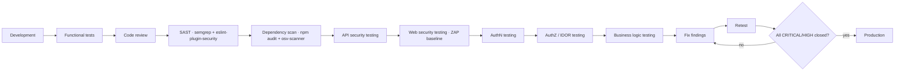

# 10 — Testing Strategy

§44: a feature is not complete without tests. This defines what "appropriate tests" means per layer,
so "done" is objective.

---

## 1. The pyramid

```
        /\        E2E (Playwright)            ~25 specs   — critical journeys only
       /  \       API / Integration           ~120 specs  — every endpoint
      /    \      Component (RTL)             ~60 specs   — interactive UI
     /______\     Unit (Vitest)               ~150 specs  — services, utils, schemas
```

Deliberately integration-heavy. In a CRUD platform the bugs live in the seams — authorization,
status filtering, validation, transactions — not in pure functions. A unit test that mocks Prisma
proves the mock works; a `supertest` call against a real SQLite file proves the endpoint works.

## 2. Tooling

| Level | Tool | Why |
|---|---|---|
| Unit + integration | **Vitest** | Native ESM/TS, no Babel, fast watch, one runner for both apps |
| API | **Supertest** against the exported `app` (no `listen`) | Full middleware chain, real DB, no ports |
| Component | **React Testing Library** + `jest-axe` | Behaviour, not implementation; a11y assertions inline |
| E2E | **Playwright** (chromium + webkit + mobile viewport) | Cross-browser, trace on failure, built-in a11y scan |
| Accessibility | `@axe-core/playwright` | Every public page in the E2E run |
| Load smoke | `autocannon` | Confirms rate limits and that SQLite holds under a realistic burst |

Test DB: a fresh SQLite **file** per test file (`file:./.tmp/test-${worker}.db`), migrated once and
truncated between tests. Not `:memory:` — memory mode does not exercise WAL, `busy_timeout`, or file
permissions, which is where SQLite-specific bugs actually live.

## 3. What is tested where

### Unit
Services with repositories stubbed: publish state machine, readiness validation, reading-time
calculation, slug generation and collision handling, password hashing/verification, JWT sign/verify
including expiry and tampering, CSRF comparison, IP hashing, pagination clamping, markdown sanitiser
(a dedicated payload corpus), `httpsUrlSchema` rejecting `javascript:`/`data:`, every Zod schema's
accept/reject boundaries.

### Integration / API (the core of the suite)
For **every** endpoint: happy path, validation failure, `401` unauthenticated, `403` wrong role,
`404` absent, pagination bounds, and the response envelope shape.

Explicit high-value cases:

- **Draft isolation** — for projects, articles and research: create a draft, then assert the public
  list omits it, the public detail returns `404`, it is absent from `/search`, and absent from
  `sitemap-data`. Then publish and assert all four flip.
- **Publish → unpublish → archive** transitions and their `search_index` side effects.
- **Auth**: login success/failure, identical error body for unknown-email vs wrong-password,
  lockout after N failures, refresh rotation, **refresh reuse revoking the whole family**,
  logout, logout-all, password change invalidating other sessions.
- **Authorization matrix**: a generated test that enumerates every registered admin route and calls
  it with (a) no cookie, (b) an expired token, (c) a tampered token — asserting `401` on all three.
  Generated from the router, so a new endpoint added without auth **fails the suite automatically**.
- **Mass assignment**: `POST /admin/projects` with `id`, `viewCount`, `publishedAt`, `status:'PUBLISHED'`
  in the body → `400`, and the DB unchanged.
- **IDOR**: cross-entity id substitution; sequential id probing on every admin route while unauthenticated.
- **Upload**: valid image; `.php`/`.svg`/`.exe` rejected; a PNG with a doctored `Content-Type`;
  a file over the size cap; a filename containing `../`; EXIF stripped after re-encode.
- **Contact**: valid submission stored; honeypot filled → silently accepted, nothing stored;
  4th submission in an hour → `429`; oversized message → `400`.
- **Rate limits**: each bucket hit to its boundary and one over.
- **Audit**: every mutation writes exactly one audit row with the right action/entity, and a forced
  audit failure rolls back the mutation.
- **Findings safety**: attempting to publish an `OPEN` + `CRITICAL` finding → rejected.
- **Error shape**: production mode returns no stack trace for a forced 500.

### Component
`<EntityForm>` validation and dirty-guard, `<DataTable>` sorting/pagination/empty state,
`<ConfirmDialog>` typed confirmation, `<MediaPicker>`, `<CommandPalette>` keyboard behaviour and
focus trap, theme toggle persistence, `<ContactForm>` error rendering. Each with `jest-axe`.

### E2E (critical journeys only — E2E is expensive; keep it thin)
1. Visitor: home → projects → filter by technology → open a case study → all sections render.
2. Visitor: read an article; related articles work; reading time shown.
3. Visitor: `⌘K` → search "react" → open a result.
4. Visitor: submit the contact form → success; the message appears in the admin inbox.
5. Admin: login → create project → upload cover → add technologies → save as draft →
   **verify it is invisible on the public site** → publish → **verify it is live**.
6. Admin: add a security assessment with findings → verify public rendering respects the flags.
7. Admin: reorder skills → verify the public order changes.
8. Admin: delete with confirmation → verify removal and the audit entry.
9. Admin: session expiry → silent refresh → the action still completes.
10. Unauthenticated visit to `/admin/projects` → redirected to login.
11. Dark/light toggle persists across navigation and reload.
12. Mobile viewport: navigation drawer, admin tables as cards.
13. `@axe-core/playwright` on every public route in both themes — zero serious/critical violations.

## 4. Coverage targets

| Area | Target | Enforcement |
|---|---|---|
| `services/**` | 90% lines / 85% branches | CI gate |
| `middleware/**` | 95% | CI gate |
| `repositories/**` | 80% | CI gate |
| `validators` / shared schemas | 100% of exported schemas exercised | CI gate |
| Frontend components | 70% | Reported, not gated |
| Overall | 80% | CI gate |

Coverage is a floor, not a goal. The authorization matrix and the draft-isolation suite matter more
than the percentage, and both are asserted structurally.

## 5. CI pipeline

```yaml
# .github/workflows/ci.yml
jobs:
  quality:   # lint · prettier --check · tsc -b · gitleaks
  test:      # vitest run --coverage (api + web + shared)
  e2e:       # build both apps · migrate · bootstrap · seed · playwright
  security:  # npm audit --audit-level=high · semgrep (OWASP + typescript rulesets)
  build:     # docker build api + web
```

All five must pass before merge. `main` is protected.

## 6. Security testing workflow (§45)

The pipeline the project must pass before it is considered production-ready. Each stage produces an
artefact in `docs/security/`.



Manual checklist for the F–J stages, run against a local instance
(`docs/security/manual-test-plan.md`), mapped to the **OWASP ASVS L1/L2** and covering exactly the
15 test types in the `security_assessment_tests` enum — so the platform's own assessment of itself
can be recorded in its own database as the first published Security Assessment. That is both a
dogfooding exercise and a genuinely good portfolio piece.

**Gate:** no CRITICAL or HIGH finding may be open at deploy. MEDIUM findings are either fixed or
explicitly accepted with a written rationale in the assessment record.

## 7. Test data

Factories (`tests/helpers/factories.ts`) build valid entities with overrides — no shared fixture
files that every test mutates and no dependence on seed data. Each test creates what it needs and
the DB is truncated after. Tests are order-independent and parallel-safe (one DB file per worker).
